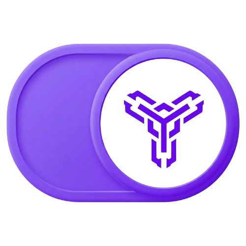

<div align="center">
  

  <h1>switchAILocal</h1>

  <p><em>One local endpoint. All your AI providers.</em></p>

  <p>
    <a href="https://switchailocal.traylinx.com/introduction"><strong>Official Documentation</strong></a> •
    <a href="#quick-start">Quick Start</a> •
    <a href="docs/user/installation.md">Installation</a> •
    <a href="docs/user/providers.md">Setup Providers</a> •
    <a href="docs/user/api-reference.md">API Reference</a>
  </p>
</div>

---

## What is switchAILocal?

**switchAILocal** is a unified API gateway that lets you use **all your AI providers** through a single OpenAI-compatible endpoint running on your machine.

### Key Benefits

| Feature                       | Description                                                                                                                                                          |
| ----------------------------- | -------------------------------------------------------------------------------------------------------------------------------------------------------------------- |
| 🎨 **Modern Web UI**           | Single-file React dashboard to configure providers, manage model routing, and adjust settings (226 KB, zero dependencies)                                            |
| 🔑 **Use Your Subscriptions**  | Connect Gemini CLI, Claude Code, Codex, Ollama, and more—no API keys needed                                                                                          |
| 🎯 **Single Endpoint**         | Any OpenAI-compatible tool works with `http://localhost:18080`                                                                                                       |
| 📎 **CLI Attachments**         | Pass files and folders directly to CLI providers via `extra_body.cli`                                                                                                |
| 🧠 **Superbrain Intelligence** | Autonomous self-healing: monitors executions, diagnoses failures with AI, auto-responds to prompts, restarts with corrective flags, and routes to fallback providers |
| ⚖️ **Load Balancing**          | Round-robin across multiple accounts per provider                                                                                                                    |
| 🔄 **Intelligent Failover**    | Smart routing to alternatives based on capabilities and success rates                                                                                                |
| 🔒 **Local-First**             | Everything runs on your machine, your data never leaves                                                                                                              |

---

## Supported Providers

### CLI Tools (Use Your Paid Subscriptions)

| Provider         | CLI Tool   | Prefix       | Status  |
| ---------------- | ---------- | ------------ | ------- |
| Google Gemini    | `gemini`   | `geminicli:` | ✅ Ready |
| Anthropic Claude | `claude`   | `claudecli:` | ✅ Ready |
| OpenAI Codex     | `codex`    | `codex:`     | ✅ Ready |
| Mistral Vibe     | `vibe`     | `vibe:`      | ✅ Ready |
| OpenCode         | `opencode` | `opencode:`  | ✅ Ready |

### Local Models

| Provider  | Prefix      | Status  |
| --------- | ----------- | ------- |
| Ollama    | `ollama:`   | ✅ Ready |
| LM Studio | `lmstudio:` | ✅ Ready |

### Cloud APIs

| Provider              | Prefix           | Status  |
| --------------------- | ---------------- | ------- |
| **Traylinx switchAI** | `switchai:`      | ✅ Ready |
| Google AI Studio      | `gemini:`        | ✅ Ready |
| Anthropic API         | `claude:`        | ✅ Ready |
| OpenAI API            | `openai:`        | ✅ Ready |
| OpenRouter            | `openai-compat:` | ✅ Ready |

---

## Prerequisites

| Requirement | Minimum  | Notes                                      |
| ----------- | -------- | ------------------------------------------ |
| **Go**      | 1.24+    | `./ail.sh setup` can auto-install via brew |
| **Docker**  | Optional | Only needed for `ail start --docker`       |
| **macOS**   | Ventura+ | Linux support is experimental              |

---

## Quick Start

### 1. Clone & Setup

We provide a unified Hub Script (`ail.sh`) to manage everything.

```bash
git clone https://github.com/traylinx/switchAILocal.git
cd switchAILocal

# First-time setup (builds binaries, installs bridge service, registers CLI)
./ail.sh setup

# Then start the server (from anywhere, after setup)
ail start

# OR start with Docker (add --build to force rebuild)
ail start --docker --build
```

### 2. Connect Your Providers

Choose the authentication method that works best for you:

#### Option A: Local CLI Wrappers (Recommended - Zero Setup)

**If you already have `gemini`, `claude`, or `vibe` CLI tools installed and authenticated**, switchAILocal uses them automatically. **No additional login required!**

```bash
# Just use the CLI prefix - it works immediately
curl http://localhost:18080/v1/chat/completions \
  -H "Content-Type: application/json" \
  -H "Authorization: Bearer sk-test-123" \
  -d '{"model": "geminicli:gemini-2.5-pro", "messages": [...]}'
```

- ✅ **Zero configuration** - Uses your existing CLI authentication
- ✅ **Works immediately** - No `--login` needed
- ✅ **Supports:** `geminicli:`, `claudecli:`, `codex:`, `vibe:`, `opencode:`

#### Option B: API Keys (Standard)

Add your AI Studio or Anthropic API keys to `config.yaml`:

```yaml
gemini:
  api-key: "your-gemini-api-key"
claude:
  api-key: "your-claude-api-key"
```

Then use without the `cli` suffix: `gemini:`, `claude:`

#### Option C: OAuth Cloud Proxy (Advanced - Alternative to CLI)

**Only needed if:**
- ❌ You don't have the CLI tools installed
- ❌ You don't have API keys
- ✅ You want switchAILocal to manage OAuth tokens directly

```bash
# Optional OAuth login (alternative to CLI wrappers)
./switchAILocal --login        # Google Gemini OAuth
./switchAILocal --claude-login # Anthropic Claude OAuth
```

⚠️ **Note:** This requires `GEMINI_CLIENT_ID` and `GEMINI_CLIENT_SECRET` environment variables. Most users should use **Option A** (CLI wrappers) instead.

📖 See the [Provider Guide](docs/user/providers.md) for detailed setup instructions.

### 3. Check Status

```bash
./ail.sh status
```

The server runs on `http://localhost:18080`.

---

## Usage Examples

### Basic Request (Auto-Routing)

When you omit the provider prefix, switchAILocal automatically routes to an available provider:

```bash
curl http://localhost:18080/v1/chat/completions \
  -H "Content-Type: application/json" \
  -H "Authorization: Bearer sk-test-123" \
  -d '{
    "model": "gemini-2.5-pro",
    "messages": [{"role": "user", "content": "Hello!"}]
  }'
```

### Explicit Provider Selection

Use the `provider:model` format to route to a specific provider:

```bash
# Force Gemini CLI
curl http://localhost:18080/v1/chat/completions \
  -H "Content-Type: application/json" \
  -H "Authorization: Bearer sk-test-123" \
  -d '{
    "model": "geminicli:gemini-2.5-pro",
    "messages": [{"role": "user", "content": "Hello!"}]
  }'

# Force Ollama
curl http://localhost:18080/v1/chat/completions \
  -H "Content-Type: application/json" \
  -H "Authorization: Bearer sk-test-123" \
  -d '{
    "model": "ollama:llama3.2",
    "messages": [{"role": "user", "content": "Hello!"}]
  }'

# Force Claude CLI
curl http://localhost:18080/v1/chat/completions \
  -H "Content-Type: application/json" \
  -H "Authorization: Bearer sk-test-123" \
  -d '{
    "model": "claudecli:claude-sonnet-4",
    "messages": [{"role": "user", "content": "Hello!"}]
  }'

# Force LM Studio
curl http://localhost:18080/v1/chat/completions \
  -H "Content-Type: application/json" \
  -H "Authorization: Bearer sk-test-123" \
  -d '{
    "model": "lmstudio:mistral-7b",
    "messages": [{"role": "user", "content": "Hello!"}]
  }'
```

### List Available Models

```bash
curl http://localhost:18080/v1/models \
  -H "Authorization: Bearer sk-test-123"
```

---

## SDK Integration

### Python (OpenAI SDK)

```python
from openai import OpenAI

client = OpenAI(
    base_url="http://localhost:18080/v1",
    api_key="sk-test-123",  # Must match a key in config.yaml
)

# Recommended: Auto-routing (switchAILocal picks the best available provider)
completion = client.chat.completions.create(
    model="gemini-2.5-pro",  # No prefix = auto-route to any logged-in provider
    messages=[
        {"role": "user", "content": "What is the meaning of life?"}
    ]
)
print(completion.choices[0].message.content)

# Streaming example
stream = client.chat.completions.create(
    model="gemini-2.5-pro",
    messages=[{"role": "user", "content": "Tell me a story"}],
    stream=True,
)

for chunk in stream:
    if chunk.choices[0].delta.content:
        print(chunk.choices[0].delta.content, end="", flush=True)

# Optional: Explicit provider selection (use prefix only when needed)
completion = client.chat.completions.create(
    model="ollama:llama3.2",  # Force Ollama provider
    messages=[{"role": "user", "content": "Hello!"}]
)
```

### JavaScript/Node.js (OpenAI SDK)

```javascript
import OpenAI from 'openai';

const client = new OpenAI({
  baseURL: 'http://localhost:18080/v1',
  apiKey: 'sk-test-123', // Must match a key in config.yaml
});

async function main() {
  // Auto-routing
  const completion = await client.chat.completions.create({
    model: 'gemini-2.5-pro',
    messages: [
      { role: 'user', content: 'What is the meaning of life?' }
    ],
  });

  console.log(completion.choices[0].message.content);

  // Explicit provider selection
  const ollamaResponse = await client.chat.completions.create({
    model: 'ollama:llama3.2',  // Force Ollama
    messages: [
      { role: 'user', content: 'Hello!' }
    ],
  });
}

main();
```

### Streaming Example (Python)

```python
from openai import OpenAI

client = OpenAI(
    base_url="http://localhost:18080/v1",
    api_key="sk-test-123",
)

stream = client.chat.completions.create(
    model="geminicli:gemini-2.5-pro",
    messages=[{"role": "user", "content": "Tell me a story"}],
    stream=True,
)

for chunk in stream:
    if chunk.choices[0].delta.content:
        print(chunk.choices[0].delta.content, end="", flush=True)
```

---

## Configuration

All settings are in `config.yaml`. Copy the example to get started:

```bash
cp config.example.yaml config.yaml
```

Key configuration options:

```yaml
# Server port (default: 18080)
port: 18080

# Enable Ollama integration
ollama:
  enabled: true
  base-url: "http://localhost:11434"

# Enable LM Studio
lmstudio:
  enabled: true
  base-url: "http://localhost:1234/v1"

# Enable LUA plugins for request/response modification
plugin:
  enabled: true
  plugin-dir: "./plugins"
```

📖 See [Configuration Guide](docs/user/configuration.md) for all options.

---

## Cortex Router: Intelligent Model Selection

The **Cortex Router** plugin provides intelligent, multi-tier routing that automatically selects the optimal model based on request content.

### Quick Start

Enable intelligent routing in `config.yaml`:

```yaml
plugin:
  enabled: true
  enabled-plugins:
    - "cortex-router"

intelligence:
  enabled: true
  router-model: "ollama:qwen:0.5b"  # Fast classification model
  matrix:
    coding: "switchai-chat"
    reasoning: "switchai-reasoner"
    fast: "switchai-fast"
    secure: "ollama:llama3.2"  # Local model for sensitive data
```

### How It Works

When you use `model="auto"` or `model="cortex"`, the router analyzes your request through multiple tiers:

1. **Reflex Tier** (<1ms): Pattern matching for obvious cases (code blocks → coding model, PII → secure model)
2. **Semantic Tier** (<20ms): Embedding-based intent matching (requires Phase 2)
3. **Cognitive Tier** (200-500ms): LLM-based classification with confidence scoring

```python
# Automatic intelligent routing
completion = client.chat.completions.create(
    model="auto",  # Let Cortex Router decide
    messages=[{"role": "user", "content": "Write a Python function to sort a list"}]
)
# → Routes to coding model automatically
```

### Phase 2 Features (Optional)

Enable advanced features for even smarter routing:

```yaml
intelligence:
  enabled: true
  
  # Semantic matching (faster than LLM classification)
  embedding:
    enabled: true
  semantic-tier:
    enabled: true
  
  # Skill-based prompt augmentation
  skill-matching:
    enabled: true
  
  # Quality-based model cascading
  cascade:
    enabled: true
```

**21 Pre-built Skills** including:
- Language experts (Go, Python, TypeScript)
- Infrastructure (Docker, Kubernetes, DevOps)
- Security, Testing, Debugging
- Frontend, Vision, and more

📖 See [Cortex Router Phase 2 Guide](docs/CORTEX_ROUTER_PHASE2.md) for full documentation.

---

## Documentation

📚 **[Read the Official switchAILocal Documentation](https://switchailocal.traylinx.com/introduction)**

### For Users

| Guide                                                     | Description                                                |
| --------------------------------------------------------- | ---------------------------------------------------------- |
| [Installation](docs/user/installation.md)                 | Getting started guide                                      |
| [Configuration](docs/user/configuration.md)               | All configuration options                                  |
| [Providers](docs/user/providers.md)                       | Setting up AI providers                                    |
| [API Reference](docs/user/api-reference.md)               | REST API documentation                                     |
| [Intelligent Systems](docs/user/intelligent-systems.md)   | Memory, Heartbeat, Steering, and Hooks                     |
| [Advanced Features](docs/user/advanced-features.md)       | Payload overrides, failover, and more                      |
| [State Box](docs/user/state-box.md)                       | Secure state management & configuration                    |
| [Management Dashboard](docs/user/management-dashboard.md) | Modern web UI for provider setup, model routing & settings |

### Build from Source

```bash
# Recommended: use the setup script
./ail.sh setup

# OR build manually
go build -o switchAILocal ./cmd/server
go build -o bridge-agent ./cmd/bridge-agent

# Build the Management UI (optional)
./ail_ui.sh
```

### For Developers

| Guide                                          | Description                         |
| ---------------------------------------------- | ----------------------------------- |
| [SDK Usage](docs/developer/sdk-usage.md)       | Embed switchAILocal in your Go apps |
| [LUA Plugins](docs/developer/lua-plugins.md)   | Custom request/response hooks       |
| [SDK Advanced](docs/developer/sdk-advanced.md) | Create custom providers             |

---

## Contributing

Contributions are welcome!

1. Fork the repository
2. Create your feature branch (`git checkout -b feature/amazing-feature`)
3. Commit your changes
4. Push and open a Pull Request

---

## License

MIT License - see [LICENSE](LICENSE) for details.

---

<div align="center">
  <strong>Maintained by Sebastian Schkudlara</strong>
</div>
