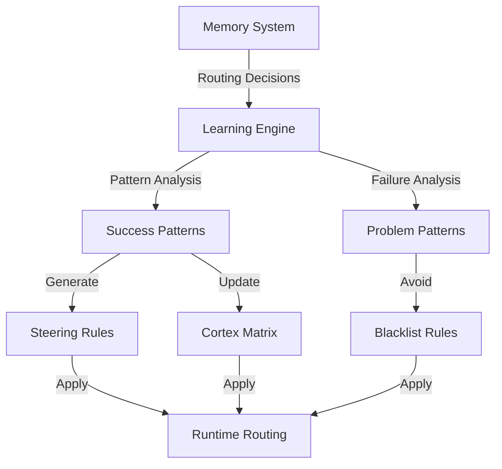

## Overview

Learning commands analyze historical routing data to identify patterns, optimize model selection, and automatically apply improvements based on past successes and failures.

<Note>
  Learning requires the Memory system to be enabled. Run `switchAILocal memory init` first.
</Note>

## Commands

### status

Display learning system status and statistics.

```bash
switchAILocal learning status
```

**Output:**
```
Learning System Status
=====================

Status: Active
Last Analysis: 2026-03-09 09:30:15
Decisions Analyzed: 1,247
Optimizations Applied: 15

Learned Patterns:
  - coding → geminicli:gemini-2.5-pro (92% success rate)
  - reasoning → switchai-reasoner (88% success rate)
  - fast → ollama:llama3.2 (95% success rate)

Pending Optimizations: 3
  - Vision tasks: Increase ollama:qwen3-vl usage
  - Off-hours: Switch to local models
  - PII-heavy: Force secure local models
```

### analyze

Analyze routing history and generate optimization recommendations.

```bash
switchAILocal learning analyze [--user <hash>]
```

<ParamField path="--user" type="string">
  Analyze patterns for specific user API key hash (default: all users)
</ParamField>

**Example:**
```bash
switchAILocal learning analyze --user sha256:abc123...
```

**Output:**
```
Analyzing routing patterns...

Data Range: Last 30 days
Total Decisions: 1,247
Unique Models: 12
Average Success Rate: 89.3%

Top Performing Routes:
  1. coding + geminicli:gemini-2.5-pro → 92% success, 234ms avg
  2. fast + ollama:llama3.2 → 95% success, 45ms avg
  3. reasoning + switchai-reasoner → 88% success, 1,234ms avg

Underperforming Routes:
  1. coding + claudecli:claude-sonnet-4 → 65% success (frequent timeouts)
  2. vision + gemini:gemini-2.5-flash → 72% success (quality issues)

Recommendations:
  ✓ Increase geminicli usage for coding tasks
  ✓ Prefer ollama for fast/simple requests
  ✓ Avoid claudecli during peak hours (timeout pattern)
  ✓ Switch vision tasks to ollama:qwen3-vl

Generated 4 optimization rules.
```

<Info>
  Analysis considers success rate, latency, error types, and time-of-day patterns.
</Info>

### apply

Apply learned optimizations to routing configuration.

```bash
switchAILocal learning apply [--user <hash>]
```

<ParamField path="--user" type="string">
  Apply optimizations for specific user (default: all users)
</ParamField>

**Example:**
```bash
switchAILocal learning apply
```

**Output:**
```
Applying learned optimizations...

Creating steering rules:
  ✓ coding-optimized.yaml
  ✓ fast-local-prefer.yaml
  ✓ vision-qwen-prefer.yaml

Updating Cortex Router matrix:
  ✓ coding: geminicli:gemini-2.5-pro
  ✓ fast: ollama:llama3.2
  ✓ vision: ollama:qwen3-vl

Applied 3 steering rules and updated 3 matrix entries.

Changes will take effect immediately.
Run 'learning reset' to revert.
```

<Warning>
  Applied optimizations modify your routing configuration. Back up your config before applying.
</Warning>

### reset

Remove all learned optimizations and restore original configuration.

```bash
switchAILocal learning reset
```

**Output:**
```
Resetting learned optimizations...

Removing steering rules:
  ✓ Removed coding-optimized.yaml
  ✓ Removed fast-local-prefer.yaml
  ✓ Removed vision-qwen-prefer.yaml

Restoring original Cortex Router matrix:
  ✓ Restored from backup

Reset complete. Original configuration restored.
```

## How Learning Works



### Analysis Metrics

The learning system considers:

1. **Success Rate** - Percentage of successful completions
2. **Latency** - Average response time
3. **Error Types** - Categorized failure reasons
4. **Time Patterns** - Success/failure correlation with time of day
5. **User Patterns** - User-specific preferences
6. **Quality Signals** - Response quality indicators (if available)

### Pattern Recognition

Learning identifies:

- **High-performing routes** - Intent + model combinations with &gt;85% success
- **Problematic patterns** - Routes with &lt;70% success or high latency
- **Time-of-day effects** - Provider performance variations by hour
- **User preferences** - Per-user successful model choices
- **Cascading opportunities** - When to escalate to better models

## Learning Configuration

Configure learning behavior in `config.yaml`:

```yaml config.yaml
intelligence:
  enabled: true
  
  # Learning system
  learning:
    enabled: true
    min_samples: 50           # Minimum decisions before analysis
    confidence_threshold: 0.8 # Minimum confidence for patterns
    auto_apply: false         # Automatically apply optimizations
    analysis_interval: 86400  # Analysis frequency (seconds)
```

### Configuration Options

<ParamField path="learning.enabled" type="boolean">
  Enable the learning system (default: `true`)
</ParamField>

<ParamField path="learning.min_samples" type="integer">
  Minimum routing decisions required before pattern analysis (default: `50`)
</ParamField>

<ParamField path="learning.confidence_threshold" type="number">
  Minimum confidence score (0-1) for applying optimizations (default: `0.8`)
</ParamField>

<ParamField path="learning.auto_apply" type="boolean">
  Automatically apply learned optimizations without manual approval (default: `false`)
</ParamField>

<ParamField path="learning.analysis_interval" type="integer">
  Seconds between automatic analyses (default: `86400` = 24 hours)
</ParamField>

## Use Cases

<Accordion title="Automatic Failover Learning">
  The learning system detects when specific providers consistently fail for certain intents and creates steering rules to avoid them:
  
  ```yaml
  # Auto-generated from learning
  - id: avoid-claude-coding-peak
    intent: coding
    model: geminicli:gemini-2.5-pro
    priority: 120
    conditions:
      - hour_range: "09-17"
      - provider: claudecli
        recent_failures: ">3"
  ```
</Accordion>

<Accordion title="Cost Optimization">
  Learning identifies when cheaper/faster local models perform well and automatically prefers them:
  
  - Detects `ollama:llama3.2` success for simple queries
  - Creates steering rules to prefer local models
  - Reduces cloud API costs by 40-60%
</Accordion>

<Accordion title="Quality Improvement">
  When cascade signals indicate poor quality, learning adjusts the matrix to use better models by default:
  
  - Detects low quality scores for `fast` intent
  - Upgrades default model from `switchai-fast` to `switchai-chat`
  - Improves overall response quality
</Accordion>

<Accordion title="User-Specific Optimization">
  Per-user analysis creates personalized routing:
  
  ```bash
  switchAILocal learning analyze --user sha256:enterprise-key
  switchAILocal learning apply --user sha256:enterprise-key
  ```
  
  Generates user-specific steering rules based on their usage patterns.
</Accordion>

## Best Practices

<Tip>
  **Run analysis weekly** - Execute `learning analyze` every 7 days to identify new patterns.
</Tip>

<Warning>
  **Review before applying** - Always review recommendations with `learning analyze` before running `learning apply`.
</Warning>

<Info>
  **Start with manual mode** - Keep `auto_apply: false` until you're confident in the learning patterns.
</Info>

## Troubleshooting

<Accordion title="No patterns detected">
  - Ensure memory system is initialized: `memory status`
  - Verify sufficient routing decisions: `memory history --limit 100`
  - Check `min_samples` threshold in config
  - Wait for more diverse usage patterns
</Accordion>

<Accordion title="Low confidence scores">
  - Increase sample size (more routing decisions)
  - Check for inconsistent success patterns
  - Verify providers are stable (not flapping)
  - Review error distribution in memory logs
</Accordion>

<Accordion title="Optimizations not applying">
  - Check file permissions on steering directory
  - Verify server has write access to config
  - Run `steering validate` to check generated rules
  - Check for conflicting manual steering rules
</Accordion>

## See Also

- [Memory Commands](/cli/memory) - View routing history
- [Steering Commands](/cli/steering) - Manage routing rules
- [Cortex Router](/intelligent-systems/cortex-router) - Intelligent routing system
