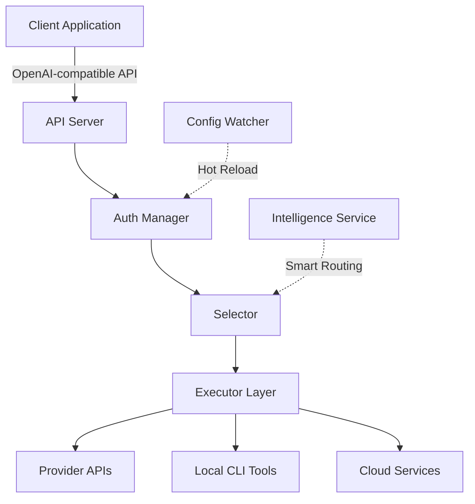

## Overview

switchAILocal is a unified AI proxy server that provides OpenAI-compatible API interfaces for multiple AI service providers. It acts as an intelligent gateway that manages authentication, routing, and request translation across CLI tools, cloud APIs, and local models.

## Core Components

The architecture is built around several key subsystems that work together to provide a seamless proxy experience:

<CardGroup cols={2}>
  <Card title="Service Manager" icon="gear">
    Orchestrates the complete lifecycle including authentication, file watching, HTTP server, and provider integrations.
  </Card>
  <Card title="Auth Manager" icon="key">
    Handles credential management, OAuth flows, API keys, and automatic token refresh for all providers.
  </Card>
  <Card title="Executor Layer" icon="play">
    Provider-specific executors that handle request translation and execution against upstream APIs.
  </Card>
  <Card title="Intelligence Service" icon="brain">
    Powers Cortex Router Phase 2 with semantic matching, intent classification, and dynamic model allocation.
  </Card>
</CardGroup>

## System Flow



<Note>
The architecture supports hot-reloading of configuration changes without requiring a server restart.
</Note>

## Request Lifecycle

### 1. Request Reception

The API server (`cmd/server/main.go`) receives OpenAI-compatible requests:

```go
// Server starts with configuration
func StartService(cfg *config.Config, configPath string, password string)
```

### 2. Authentication

The **Auth Manager** (`sdk/switchailocal/auth/conductor.go`) orchestrates credential selection:

```go
type Manager struct {
    store     Store
    executors map[string]ProviderExecutor
    selector  Selector
    auths     map[string]*Auth
}
```

<Accordion title="Auth Manager Responsibilities">
- **Credential Selection**: Choose appropriate credentials using routing strategies
- **State Management**: Track auth status, quota limits, and cooldown periods
- **Auto-Refresh**: Automatically refresh OAuth tokens before expiration
- **Failure Handling**: Mark credentials unavailable and implement backoff strategies
</Accordion>

### 3. Routing & Execution

The system uses a **Selector** to pick credentials based on your routing strategy:

```go
type Selector interface {
    Pick(ctx context.Context, provider, model string, 
         opts Options, auths []*Auth) (*Auth, error)
}
```

Built-in selectors:
- **RoundRobinSelector**: Distributes requests evenly across credentials
- **FillFirstSelector**: Uses first credential until exhausted

### 4. Provider Execution

Each provider has a dedicated **Executor** that implements:

```go
type ProviderExecutor interface {
    Identifier() string
    Execute(ctx context.Context, auth *Auth, 
            req Request, opts Options) (Response, error)
    ExecuteStream(ctx context.Context, auth *Auth,
                  req Request, opts Options) (<-chan StreamChunk, error)
    Refresh(ctx context.Context, auth *Auth) (*Auth, error)
}
```

<CardGroup cols={3}>
  <Card title="CLI Executors" icon="terminal">
    GeminiCLIExecutor
    
    OllamaExecutor
    
    OpenCodeExecutor
  </Card>
  <Card title="Cloud Executors" icon="cloud">
    GeminiExecutor
    
    ClaudeExecutor
    
    CodexExecutor
  </Card>
  <Card title="Compat Executors" icon="plug">
    OpenAICompatExecutor
    
    LMStudioExecutor
    
    AntigravityExecutor
  </Card>
</CardGroup>

## Token Translation Pipeline

Requests flow through a translation pipeline (`sdk/translator/pipeline.go`) that converts between formats:

```text
OpenAI Format → Gemini Format
OpenAI Format → Claude Format  
Gemini Format → OpenAI Format
... and more
```

<Tip>
The translator supports bidirectional conversion, allowing you to use any API format with any provider.
</Tip>

## State Management

### Auth State

Each authentication credential tracks its own state:

```go
type Auth struct {
    ID              string
    Provider        string
    Status          Status        // Active, Error, Disabled
    Unavailable     bool
    NextRetryAfter  time.Time
    Quota           QuotaState
    ModelStates     map[string]*ModelState
}
```

### Model-Level State

Fine-grained tracking per model per credential:

```go
type ModelState struct {
    Unavailable     bool
    Status          Status
    NextRetryAfter  time.Time
    Quota           QuotaState
    LastError       *Error
}
```

<Note>
Model-level state allows one API key to serve `gpt-4` while `gpt-3.5-turbo` is in cooldown.
</Note>

## Concurrency Model

The system uses Go's concurrency primitives for safe operation:

```go
type Manager struct {
    mu              sync.RWMutex  // Protects auth map
    auths           map[string]*Auth
    providerOffsets map[string]int // Round-robin state
}
```

- **Read locks** for credential selection (high throughput)
- **Write locks** only for state updates
- **Atomic operations** for retry counters

## Storage Layer

Multiple storage backends for different deployment scenarios:

<CardGroup cols={2}>
  <Card title="File Store" icon="file">
    Local filesystem storage for single-node deployments
    
    ```yaml
    auth-dir: "~/.switchailocal"
    ```
  </Card>
  <Card title="Postgres Store" icon="database">
    Distributed storage for multi-node deployments
    
    ```bash
    PGSTORE_DSN=postgres://...
    ```
  </Card>
  <Card title="Git Store" icon="git-alt">
    Version-controlled storage with remote sync
    
    ```bash
    GITSTORE_GIT_URL=https://...
    ```
  </Card>
  <Card title="Object Store" icon="box">
    S3-compatible storage for cloud deployments
    
    ```bash
    OBJECTSTORE_ENDPOINT=s3.amazonaws.com
    ```
  </Card>
</CardGroup>

## Hot-Reload Mechanism

The **Config Watcher** (`internal/watcher/watcher.go`) monitors configuration changes:

```go
type Watcher struct {
    configPath string
    authDir    string
    dispatcher *Dispatcher
}
```

When changes are detected:
1. Parse new configuration
2. Calculate diff from current state
3. Dispatch targeted updates (add/remove/update)
4. Reload executors without dropping connections

<Tip>
You can add new API keys or update models without restarting the server.
</Tip>

## WebSocket Gateway

For real-time streaming providers:

```go
type Manager struct {
    sessions map[string]*Session
    mu       sync.RWMutex
}
```

Supports long-lived connections for providers like Gemini Live API.

## Intelligence Layer (Cortex Phase 2)

When enabled, the Intelligence Service adds:

- **Semantic Matching**: Embed requests and match against known patterns
- **Intent Classification**: Use LLM to classify request intent
- **Dynamic Routing**: Route based on content, not just model name
- **Skill Augmentation**: Inject context from skill definitions

```yaml
intelligence:
  enabled: true
  router-model: "ollama:gpt-oss:20b-cloud"
  semantic-tier:
    enabled: true
    confidence-threshold: 0.85
```

## Security Architecture

Security is enforced at multiple layers:

### Path Validation

```go
func validateFilePath(path string) error {
    // Check for path traversal
    if strings.Contains(path, "..") || strings.Contains(path, "~") {
        return fmt.Errorf("invalid file path")
    }
    // Validate control characters
    // Check absolute paths
}
```

### Error Sanitization

```go
func sanitizeError(err error, context string) error {
    // Remove credentials from error messages
    // Mask tokens and keys
    // Strip sensitive patterns
}
```

### File Permissions

```go
func checkFilePermissions(filePath string) error {
    // Ensure config files are not world-readable
    if mode.Perm()&0077 != 0 {
        return fmt.Errorf("insecure permissions")
    }
}
```

## Extension Points

The architecture supports custom extensions:

### Custom Executors

```go
type MyExecutor struct{}

func (e *MyExecutor) Identifier() string { return "my-provider" }
func (e *MyExecutor) Execute(...) (Response, error) { /* ... */ }

// Register with manager
manager.RegisterExecutor(myExecutor)
```

### Custom Selectors

```go
type MySelector struct{}

func (s *MySelector) Pick(ctx, provider, model, opts, auths) (*Auth, error) {
    // Custom selection logic
}

manager.SetSelector(&MySelector{})
```

### Usage Plugins

```go
type MyPlugin struct{}

func (p *MyPlugin) OnRequest(ctx, model, input, output int) {
    // Track usage
}

service.RegisterUsagePlugin(&MyPlugin{})
```

## Performance Considerations

<CardGroup cols={2}>
  <Card title="Connection Pooling" icon="network-wired">
    HTTP clients use connection pooling for reduced latency
  </Card>
  <Card title="Streaming Support" icon="water">
    SSE streaming with heartbeat keepalives
  </Card>
  <Card title="Retry Logic" icon="rotate">
    Exponential backoff with configurable limits
  </Card>
  <Card title="Quota Management" icon="gauge">
    Per-model cooldown to respect rate limits
  </Card>
</CardGroup>

## Next Steps

<CardGroup cols={2}>
  <Card title="Providers" href="/concepts/providers" icon="plug">
    Learn about supported providers and how to configure them
  </Card>
  <Card title="Routing" href="/concepts/routing" icon="route">
    Explore routing strategies and credential selection
  </Card>
  <Card title="Authentication" href="/concepts/authentication" icon="shield">
    Understand authentication flows and credential management
  </Card>
  <Card title="Configuration" href="/configuration/config-reference" icon="gear">
    Complete configuration reference
  </Card>
</CardGroup>