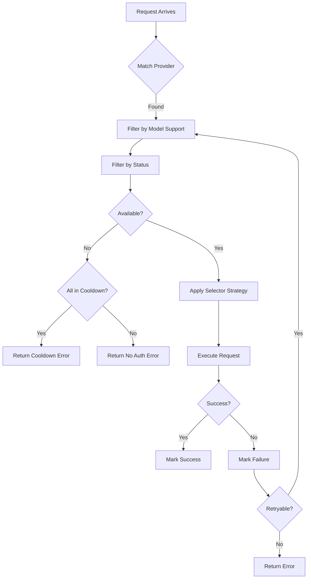
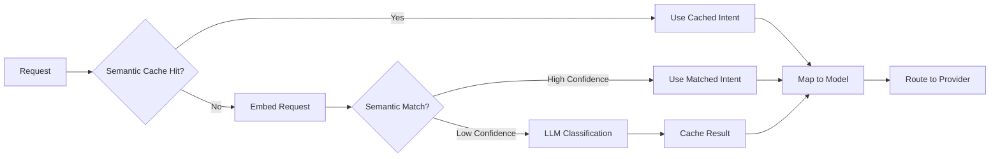

## Overview

Routing in switchAILocal determines which credential and provider handle each incoming request. The system supports multiple routing strategies, intelligent fallback, and per-model quota management.

## Routing Configuration

Configure routing behavior in `config.yaml`:

```yaml
routing:
  # Primary strategy: "round-robin" or "fill-first"
  strategy: "round-robin"
  
  # Optional: Priority list for auto model resolution
  # auto-model-priority:
  #   - "ollama:gpt-oss:120b-cloud"
  #   - "switchai-chat"
  #   - "gemini-2.5-flash"
```

## Routing Strategies

The routing strategy determines how multiple credentials for the same provider are selected.

### Round-Robin

Distributes requests evenly across all available credentials.

<Accordion title="How Round-Robin Works">
The **RoundRobinSelector** (`sdk/switchailocal/auth/selector.go`) maintains per-model cursors:

```go
type RoundRobinSelector struct {
    mu      sync.Mutex
    cursors map[string]int  // "provider:model" -> cursor
}

func (s *RoundRobinSelector) Pick(..., auths []*Auth) (*Auth, error) {
    key := provider + ":" + model
    s.mu.Lock()
    index := s.cursors[key]
    s.cursors[key] = index + 1
    s.mu.Unlock()
    return available[index % len(available)], nil
}
```

Behavior:
1. First request to `gpt-4` uses credential A
2. Second request to `gpt-4` uses credential B  
3. Third request to `gpt-4` uses credential C
4. Fourth request to `gpt-4` wraps back to credential A
</Accordion>

**Use case**: Distribute load evenly, maximize quota utilization

**Example**:
```yaml
routing:
  strategy: "round-robin"

codex-api-key:
  - api-key: "sk-proj-A..."
  - api-key: "sk-proj-B..."
  - api-key: "sk-proj-C..."
```

<Note>
Round-robin is tracked per model. Requests to `gpt-4` and `gpt-3.5-turbo` maintain independent cursors.
</Note>

### Fill-First

Uses the first available credential until it's exhausted or in cooldown, then moves to the next.

<Accordion title="How Fill-First Works">
The **FillFirstSelector** always picks the first available credential:

```go
type FillFirstSelector struct{}

func (s *FillFirstSelector) Pick(..., auths []*Auth) (*Auth, error) {
    available, err := getAvailableAuths(auths, provider, model, now)
    if err != nil {
        return nil, err
    }
    // Always return first (auths are sorted by ID for consistency)
    return available[0], nil
}
```

Behavior:
1. All requests use credential A
2. When A hits quota → switch to credential B
3. When B hits quota → switch to credential C
4. When A recovers → switch back to A
</Accordion>

**Use case**: Stagger subscription caps, optimize for rolling time windows

**Example**:
```yaml
routing:
  strategy: "fill-first"

claude-api-key:
  - api-key: "sk-ant-primary..."
  - api-key: "sk-ant-backup..."
```

<Tip>
Fill-first works well with providers that have daily/monthly quotas rather than per-minute rate limits.
</Tip>

## Credential Selection Process

The Auth Manager follows a multi-step process to select credentials:



### 1. Provider Matching

```go
func (m *Manager) Execute(ctx, providers []string, req Request, opts) {
    // Normalize and rotate provider list
    normalized := m.normalizeProviders(providers)
    rotated := m.rotateProviders(req.Model, normalized)
}
```

Provider names are normalized (lowercased, deduplicated).

### 2. Model Support Filtering

```go
for _, candidate := range m.auths {
    if candidate.Provider != provider || candidate.Disabled {
        continue
    }
    // Check model registry
    if !registryRef.ClientSupportsModel(candidate.ID, modelKey) {
        continue
    }
    candidates = append(candidates, candidate)
}
```

Credentials are filtered based on model support from the registry.

### 3. Status Filtering

```go
func getAvailableAuths(auths, provider, model, now) ([]*Auth, error) {
    available, cooldownCount, earliest := collectAvailable(auths, model, now)
    
    if len(available) == 0 {
        if cooldownCount == len(auths) && !earliest.IsZero() {
            resetIn := earliest.Sub(now)
            return nil, newModelCooldownError(model, provider, resetIn)
        }
        return nil, &Error{Code: "auth_unavailable"}
    }
    return available, nil
}
```

Checks:
- Not disabled (`auth.Disabled == false`)
- Not unavailable (`auth.Unavailable == false`)
- Past retry time (`auth.NextRetryAfter < now`)
- Model-specific state (if tracked)

### 4. Strategy Application

The selected strategy picks one credential from the available pool:

```go
auth, err := m.selector.Pick(ctx, provider, model, opts, candidates)
```

## Multi-Provider Routing

You can specify multiple providers for the same model:

```yaml
routing:
  strategy: "round-robin"

# Same model available from multiple providers
codex-api-key:
  - api-key: "sk-proj-openai..."
    models:
      - name: "gpt-4o"

openai-compatibility:
  - name: "openrouter"
    prefix: "or"
    api-key-entries:
      - api-key: "sk-or-v1..."
    # Also provides gpt-4o
```

When both providers support `gpt-4o`:
1. Manager tries OpenAI provider first
2. If OpenAI is in cooldown → tries OpenRouter
3. Rotates starting provider on next request

<Note>
Per-model provider rotation ensures even distribution when multiple providers offer the same model.
</Note>

## Intelligent Routing (Cortex Phase 2)

When Intelligence is enabled, routing becomes content-aware:

```yaml
intelligence:
  enabled: true
  router-model: "ollama:gpt-oss:20b-cloud"
  
  matrix:
    coding: "switchai-chat"
    reasoning: "switchai-reasoner"
    fast: "switchai-fast"
    secure: "ollama:llama3.2"
    vision: "ollama:qwen3-vl:235b-instruct-cloud"
  
  semantic-tier:
    enabled: true
    confidence-threshold: 0.85
```

### Classification Flow



<Accordion title="Intent Classification">
The Intelligence Service uses the router model to classify requests:

```go
type Classification struct {
    Intent     string   // "coding", "reasoning", "fast", etc.
    Confidence float64  // 0.0 to 1.0
    Model      string   // Resolved model from matrix
}

func (s *Service) Classify(ctx, req) (*Classification, error) {
    // 1. Check semantic cache
    // 2. Try semantic matching with embeddings
    // 3. Fall back to LLM classification
    // 4. Apply confidence thresholds
}
```

Intent mapping:
- **coding**: Code generation, debugging, refactoring
- **reasoning**: Complex problem-solving, math, logic  
- **fast**: Simple queries, casual conversation
- **secure**: Privacy-sensitive, runs locally only
- **vision**: Image analysis, OCR, visual tasks
</Accordion>

## Quota Management

Quota tracking prevents retry storms when providers hit rate limits.

### Quota States

Each credential tracks quota status:

```go
type QuotaState struct {
    Exceeded      bool      // Currently over quota
    Reason        string    // "quota", "rate_limit", etc.
    NextRecoverAt time.Time // When quota resets
    BackoffLevel  int       // Exponential backoff level
}
```

### Backoff Schedule

Exponential backoff prevents hammering rate-limited providers:

```go
func nextQuotaCooldown(prevLevel int) (time.Duration, int) {
    cooldown := quotaBackoffBase * time.Duration(1<<prevLevel)
    // Level 0: 1 second
    // Level 1: 2 seconds
    // Level 2: 4 seconds
    // Level 3: 8 seconds
    // ...
    // Max: 30 minutes
    if cooldown >= quotaBackoffMax {
        return quotaBackoffMax, prevLevel
    }
    return cooldown, prevLevel + 1
}
```

<Tip>
Set `quota-exceeded.switch-project: true` to automatically switch to another credential when quota is hit.
</Tip>

### Model-Level Quotas

Quotas are tracked per-model for fine-grained control:

```yaml
# API key exhausted gpt-4 quota but gpt-3.5-turbo still works
type Auth struct {
    ModelStates map[string]*ModelState
}

type ModelState struct {
    Quota QuotaState  // Per-model quota tracking
}
```

Behavior:
```bash
# Request 1: gpt-4 with key-A → Success
# Request 2: gpt-4 with key-A → 429 Too Many Requests
# Request 3: gpt-4 with key-A → Skipped (in cooldown)
# Request 4: gpt-4 with key-B → Success (different key)
# Request 5: gpt-3.5-turbo with key-A → Success (different model)
```

## Retry Logic

Configurable retry behavior for transient failures:

```yaml
request-retry: 3  # Retry up to 3 times

streaming:
  bootstrap-retries: 2  # Retries before first byte
```

<Accordion title="Retry Decision Logic">
```go
func (m *Manager) shouldRetryAfterError(err error, attempt, maxAttempts int, 
                                        providers []string, model string, 
                                        maxWait time.Duration) (time.Duration, bool) {
    // No retry on last attempt
    if attempt >= maxAttempts-1 {
        return 0, false
    }
    
    // Check if any credential will recover soon
    wait, found := m.closestCooldownWait(providers, model)
    if !found || wait > maxWait {
        return 0, false
    }
    
    return wait, true
}
```

Retry conditions:
- Not the final attempt
- At least one credential will recover within `maxWait`
- Error is retryable (408, 429, 500, 502, 503, 504)
</Accordion>

## Fallback Chains

Automatic fallback when quota is exceeded:

```yaml
quota-exceeded:
  switch-project: true       # Try next credential
  switch-preview-model: true # Try preview/alternative models
```

Fallback order:
1. Try next credential for same model
2. Try preview model with same credential  
3. Try preview model with next credential
4. Return cooldown error

## Load Balancing

Distribute requests across providers:

```yaml
openai-compatibility:
  # Multiple providers for same models
  - name: "groq"
    prefix: "groq"
    api-key-entries:
      - api-key: "gsk-A..."
      - api-key: "gsk-B..."
  
  - name: "openrouter"  
    prefix: "or"
    api-key-entries:
      - api-key: "sk-or-v1-A..."
      - api-key: "sk-or-v1-B..."
```

With `round-robin` strategy:
- Request 1 → groq key-A
- Request 2 → groq key-B
- Request 3 → openrouter key-A  
- Request 4 → openrouter key-B
- Request 5 → groq key-A (rotation)

## Custom Selectors

Implement custom routing logic:

```go
type MyCustomSelector struct {
    // Your state
}

func (s *MyCustomSelector) Pick(ctx context.Context, 
                                provider, model string,
                                opts executor.Options,
                                auths []*Auth) (*Auth, error) {
    // Filter by metadata
    for _, auth := range auths {
        if region, ok := auth.Metadata["region"].(string); ok {
            if region == "us-west" {
                return auth, nil
            }
        }
    }
    // Fallback to first
    return auths[0], nil
}

// Register
service.CoreManager().SetSelector(&MyCustomSelector{})
```

<Note>
Custom selectors receive only available credentials (already filtered by status and cooldown).
</Note>

## Next Steps

<CardGroup cols={2}>
  <Card title="Authentication" href="/concepts/authentication" icon="key">
    Learn about credential lifecycle and refresh
  </Card>
  <Card title="Providers" href="/concepts/providers" icon="plug">
    Configure provider-specific settings
  </Card>
  <Card title="Intelligence" href="/features/intelligence" icon="brain">
    Enable semantic routing and classification
  </Card>
  <Card title="Configuration" href="/configuration/routing" icon="gear">
    Complete routing configuration reference
  </Card>
</CardGroup>