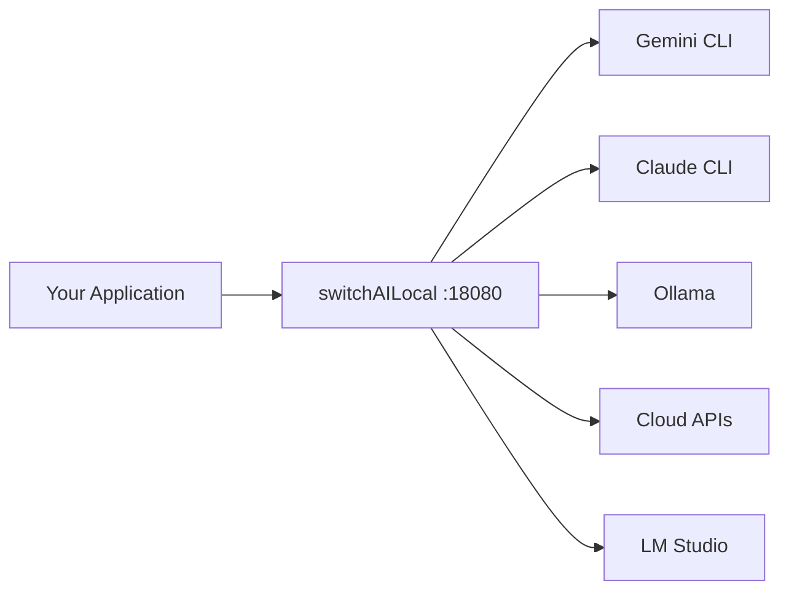

# Welcome to switchAILocal

**switchAILocal** is a unified AI gateway that lets you use **all your AI providers** — Gemini, Claude, Ollama, OpenAI, and more — through a single local endpoint. No cloud, no complexity.

## Get Started in 30 Seconds

```bash
npx @traylinx/switchailocal
```

That's it. Your AI gateway is now running at `http://localhost:18080`. Any OpenAI-compatible app or tool works with it immediately.

<CardGroup cols={2}>
  <Card title="Quick Start" icon="rocket" href="/quickstart">
    Make your first request in 5 minutes
  </Card>
  <Card title="Installation Options" icon="download" href="/installation">
    npx, Docker, or build from source
  </Card>
  <Card title="Provider Setup" icon="plug" href="/guides/setup-providers">
    Connect your AI providers
  </Card>
  <Card title="API Reference" icon="code" href="/api/overview">
    Explore the OpenAI-compatible API
  </Card>
</CardGroup>

## Key Features

<CardGroup cols={2}>
  <Card title="Unified Endpoint" icon="network-wired">
    Single `http://localhost:18080` endpoint for all providers
  </Card>
  <Card title="OpenAI Compatible" icon="infinity">
    Works with any OpenAI SDK or tool out of the box
  </Card>
  <Card title="CLI Wrappers" icon="terminal">
    Use your existing Gemini, Claude, and Codex CLI subscriptions
  </Card>
  <Card title="Local Models" icon="server">
    Integrate Ollama and LM Studio for private inference
  </Card>
  <Card title="Intelligent Routing" icon="brain">
    Cortex Router automatically selects optimal models
  </Card>
  <Card title="Load Balancing" icon="scale-balanced">
    Round-robin across multiple accounts per provider
  </Card>
  <Card title="Auto Failover" icon="shield-halved">
    Smart routing to alternatives on provider failures
  </Card>
  <Card title="Self-Healing" icon="wand-magic-sparkles">
    Superbrain monitors and auto-recovers from errors
  </Card>
</CardGroup>

## Supported Providers

### CLI Tools (Use Your Subscriptions)

<AccordionGroup>
  <Accordion title="Google Gemini (geminicli:)" icon="google">
    Use the `gemini` CLI tool with your existing Google AI subscription. No API keys needed.
  </Accordion>
  <Accordion title="Anthropic Claude (claudecli:)" icon="robot">
    Use the `claude` CLI tool with your Claude Code subscription. No API keys needed.
  </Accordion>
  <Accordion title="OpenAI Codex (codex:)" icon="openai">
    Use the `codex` CLI tool with your OpenAI subscription.
  </Accordion>
  <Accordion title="Mistral Vibe (vibe:)" icon="bolt">
    Use the `vibe` CLI tool with your Mistral subscription.
  </Accordion>
  <Accordion title="OpenCode (opencode:)" icon="code">
    Use the `opencode` CLI tool for local coding assistance.
  </Accordion>
</AccordionGroup>

### Local Models

<CardGroup cols={2}>
  <Card title="Ollama" icon="llama" href="/concepts/providers#ollama">
    Run open-source models locally with Ollama
  </Card>
  <Card title="LM Studio" icon="desktop" href="/concepts/providers#lm-studio">
    Use LM Studio's local inference engine
  </Card>
</CardGroup>

### Cloud APIs

- **Google AI Studio** - Gemini models via API key
- **Anthropic API** - Claude models via API key
- **OpenAI API** - GPT models via API key
- **switchAI Cloud** - Unified access to 100+ models
- **OpenRouter** - Route to multiple cloud providers

## How It Works



1. **Point your app** to `http://localhost:18080/v1`
2. **Use any model** with optional `provider:model` prefix
3. **switchAILocal routes** your request to the right provider
4. **Get responses** in OpenAI-compatible format

<Note>
All processing happens locally. Your data never leaves your machine unless you explicitly use cloud providers.
</Note>

## Use Cases

<CardGroup cols={2}>
  <Card title="Multi-Provider Apps" icon="layer-group">
    Build apps that seamlessly switch between AI providers
  </Card>
  <Card title="Cost Optimization" icon="dollar-sign">
    Route expensive queries to local models, complex ones to cloud
  </Card>
  <Card title="Privacy-First AI" icon="lock">
    Keep sensitive data local with Ollama and LM Studio
  </Card>
  <Card title="Development Testing" icon="flask">
    Test against multiple models without changing code
  </Card>
</CardGroup>

## Next Steps

<Steps>
  <Step title="Install switchAILocal">
    Follow the [installation guide](/installation) to set up the gateway
  </Step>
  <Step title="Run the quickstart">
    Complete the [quickstart](/quickstart) to make your first request
  </Step>
  <Step title="Connect providers">
    Set up your [AI providers](/guides/setup-providers) for full functionality
  </Step>
  <Step title="Explore features">
    Learn about [intelligent routing](/intelligent-systems/cortex-router) and [advanced features](/advanced/lua-plugins)
  </Step>
</Steps>

## Community & Support

<CardGroup cols={2}>
  <Card title="GitHub Repository" icon="github" href="https://github.com/traylinx/switchAILocal">
    Star the project and contribute
  </Card>
  <Card title="Report Issues" icon="bug" href="https://github.com/traylinx/switchAILocal/issues">
    Found a bug? Let us know
  </Card>
</CardGroup>
